  

**`Software Developer · C# & .NET`**

### Sobre mim

Sou Engenheira de Software formada pela **UTFPR** e atualmente cursando pós-graduação em **Arquitetura de Sistemas .NET** pela FIAP. Trabalho como desenvolvedora especialista Back-End, com foco em **C# e .NET Core**, construindo sistemas robustos, escaláveis e que realmente fazem diferença.

Apaixonada por boas práticas, arquitetura limpa e aquele café que sustenta o segundo turno de PRs. ☕

### GitHub Stats

  
  

  

### Atualmente

- 📚 Aprofundando em **Arquitetura de Sistemas .NET** na FIAP
- 🔭 Explorando padrões avançados de **microserviços** e **event-driven architecture**
- 🤖 Estudando **IA aplicada ao desenvolvimento** — usando Claude Code, Windsurf e LLMs para acelerar entregas sem abrir mão da qualidade

---

**"First, solve the problem. Then, write the code."** — John Johnson

